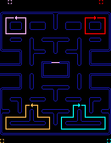

# Software Engineering Immersive: Project 1
This was my first project of the General Assembly Software Engineering Immersive course (Week 4). Due to the Festive Period, I was able to spend 15 days working on this solo project.

## Installation

* Clone or download the Repository
* Open the `index.html` in your browser of choice

## Deployment

The game is deployed using GitHub Pages and can be found [here](https://georgeanthony33.github.io/sei-project-01/).

## Technology Use

* HTML5
* CSS3
* Vanilla JavaScript (ES6)
* Google Fonts
* Git
* GitHub

## Game Architecture

Pac-Man is a grid-based video game where the player controls the Pac-Man through a maze with the objective of eating all of the food whilst simultaneously avoiding four colored ghosts — Blinky (red), Pinky (pink), Inky (cyan), and Clyde (orange) — that are chasing him. When all of the food is eaten, the player advances to the next level. If Pac-Man is caught by a ghost, he will lose a life and the game ends when all lives are lost.


### Grid Layout

Due to the numerous different behaviours required of individual tiles in the grid, the grid is hard coded using constants to represent walls, food, energizers, junctions and areas within the ghost's pen. The interactivity and dynamicity of the game revolves around setting class names to tiles based on their value and then connecting this up to CSS styling. Events, such as Pac-Man and ghost movement, can then change the value of tiles, enabling the grid to respond in real-time.

### Character Class

Each of the five characters (Pac-Man and the four ghosts) have several properties in common that must be stored, such as name, starting position, current position and current direction. They also have some functions in common such as updating the class name of the character based on its current direction, so that the styling can update to reflect this. For this reason, the characters are all originally formed from the same class "Characters", with Pac-Man then having its own class extending from this to add further functionality for user-control.

### Timers

The game uses 12 interval timers and 4 timeouts. Many of these are running independently from each other throughout the game to check for events happening such as Pac-Man eating food or an energizer, being caught by a ghost or levelling up through eating all of the food. The speed of the game can then be adjusted each time the player levels up, and also during the ghosts' Frightened mode, by changing the interval duration for Pac-Man and/or the ghosts' movement. The CSS animation speed for each movement across a tile is then updated using ```.style.setProperty``` so that the characters continue to move smoothly across the grid, regardless of their speed.

## Pac-Man Movement

Pac-Man's movement is driven by event listeners on the four directional key buttons. Important characteristics of Pac-Man's movement include:

* Being unable to pass through walls
* Being teleported to the other side of the grid upon passing through the tunnel
* Moving automatically in the same direction as the last key press, until either another valid key is pressed or he hits a wall. An example of the logic used for this is below:

```JavaScript
const proposedPos = this.currentIndex + this.proposedDirection // proposedDirection is the last direction key pressed
const predictedPos = this.currentIndex + this.currentDirection
      
// if user hits direction button, check if PacMan can go that way, if he can then let him change direction, if not allow him to automatically continue to move in his current direction, unless there is a wall where he should just stop
if (openSquares.includes(wallsArray[proposedPos])) {
  this.currentDirection = this.proposedDirection
} else if (openSquares.includes(wallsArray[predictedPos])) {
  this.currentDirection = this.currentDirection
} else {
  this.currentDirection = 0
}

this.currentIndex += this.currentDirection // update current position
```

## Ghosts AI

The ghosts are always in one of three possible modes:

1. Chase Mode
    * Majority of the ghosts' time spent in Chase mode.
    * Each of the ghosts use Pac-Man's position as a factor in selecting their target tile:
      * Red Ghost: Pac-Man's current position.
      * Cyan Ghost: Ghost looks at position that is 2 tiles ahead of Pac-Man's current position. It then draws a line from the red ghost to this position, doubles it and aims for there.
      * Orange Ghost: Pac-Man's current position when more than 8 tiles away, but Scatter Mode when 8 or less tiles away.
      * Pink Ghost: 4 tiles ahead of Pac-Man's current position

2. Scatter Mode
    * Each ghost has a fixed target tile, each of which is located just outside a different corner of the maze.
    * This causes the four ghosts to disperse to the corners whenever they are in this mode.

    

3. Frightened Mode
    * Ghosts do not have a specific target tile while in this mode. Instead, they randomly decide which turns to make at every junction. A ghost in Frightened mode also turns dark blue, moves much more slowly and can be eaten by Pac-Man. However, the duration of Frightened mode is shortened as the player progresses through the levels, and is completely eliminated from level 14 onwards.


## Reflections

### Wins

* Having had only three weeks of class on the SEI course, I was proud to complete a fully functional web-based game using HTML, CSS and Javascript.
* The Pac-Man and Ghost AI is true to life, with features such as PacMan's automatic movement and each of the ghosts modes. I am particularly pleased with the logic governing each ghosts individual movements in Chase and Scatter mode, giving them each a unique personality thus providing the player with a variety of challenges to navigate.
* The CSS animation ensures each character moves smoothly from tile to tile, giving the game a smooth feel to it.
* Sound effects that are synchronised with specific events such as the familiar "chomp" sound and the sound when a ghost captures Pac-Man.
* Game increases in difficulty with each level, due to increasing speed and decreasing time that ghosts spend in Scatter and Frightened modes.

### Challenges

* Because each piece of food needed to be on one specific tile so that it was correctly eaten by Pac-Man upon entering the tile, this potentially meant having a very narrow looking maze, with each open tile being very close to the wall tile next to it. In order to give the open tiles some more space, I had to add specific class names to certain types of wall (e.g. "left", "right.top" and even "left.bottom.inner") and then use CSS on each class to adjust the border position accordingly. I then used CSS to scale-up the size of Pac-Man to fill the extra space.
* There are various areas in the grid that had unique characteristics. One of these was the ghosts' pen where I added unique constants to the grid for these positions to siphon the ghosts out upon the game starting. The other two challenging areas were each side of the tunnel. This required very specific logic to ensure the ghosts moved through correctly and also to ensure each of the various edge cases had been addressed with regards to Pac-Man's movement and the timing of key-presses around the moment he passes through.

### Future Features

In general I am very pleased with the game I built given the timescales and the fact that this was the first project of the course. That said, with some more time, I would like to work on the following:

* Re-factor some of my code as the Characters class is lengthy. I think there may be scope for amalgamating each of the individual ghost chase modes into one function.
* Adding fruits to appear in the maze at certain times, that score extra bonus points if Pac-Man eats them before they disappear.
* Slightly reduce the speed of the ghosts through the tunnels, in-line with the real game.